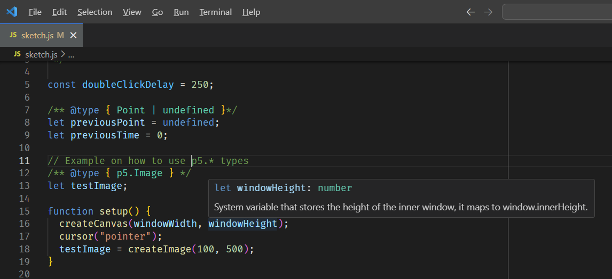
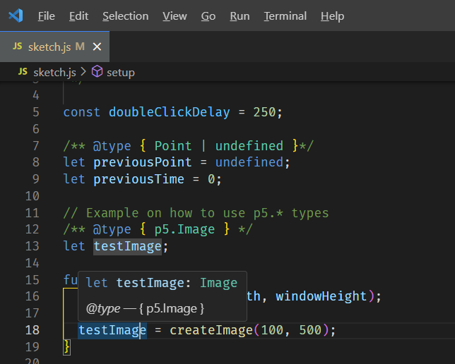
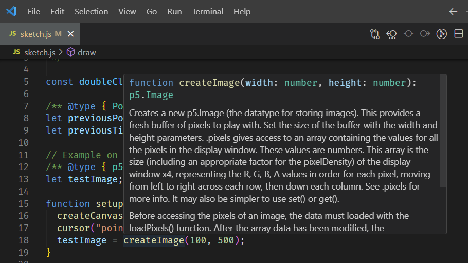

## About

Boilerplate repo for a simple "Vanilla" P5JS project with intellisense and type safety. Works with VSCode.

| Description      | Screenshot                               |
| ---------------- | ---------------------------------------- |
| Global variables |  |
| p5.\* types      |  |
| Functions        |  |

## Instructions

Install types and P5 library:

```sh
npm i
```

Use VSCode Live server extension (`ritwickdey.LiveServer`) or some other server to run the project by serving index.html.
